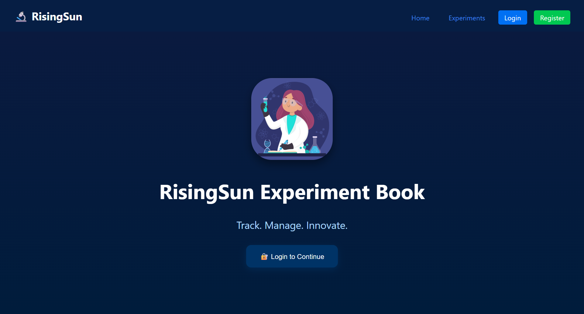
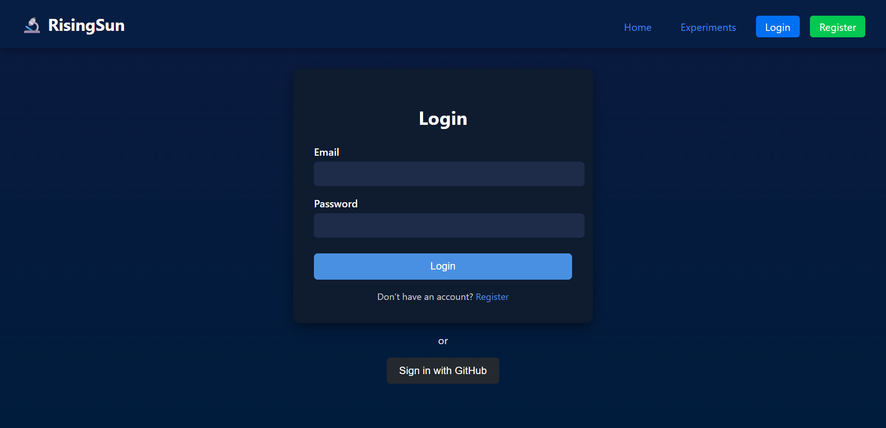
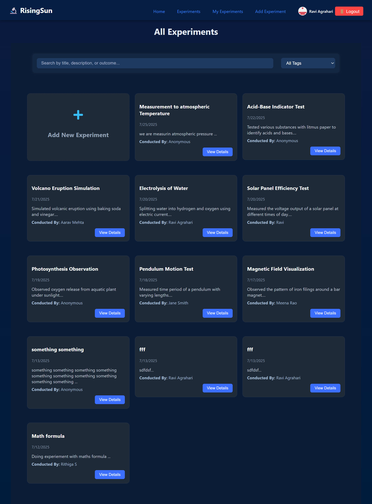
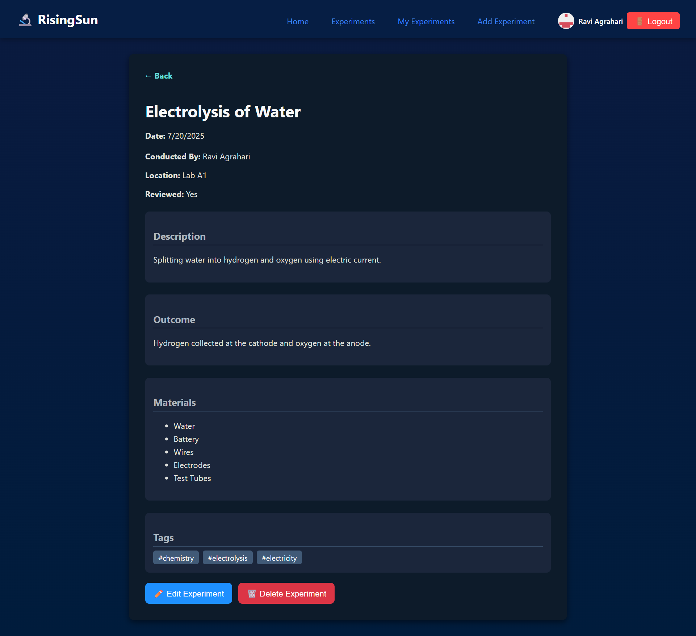

# 🌐 RisingSun Experiment Book

> RisingSun Experiment Book is a Next.js-based web app built as the final project during a Next.js bootcamp. The project focuses on learning MongoDB integration and understanding the core concepts of Next.js such as routing, API handling, and SSR.

## 🚀 Deployed Link

[RisingSun Experiment Book](https://rising-sun-experiment-book.vercel.app/)

## 🖼️ Screenshots

### 📸 Home Page  

### 📸 Login Page  

### 📸 Dashboard  

### 📸 Experiments List  

### 📸 Experiment Detail  

## 🛠️ Tech Stack

- Frontend: Next.js
- Backend: —
- Database: MongoDB
- Others: Axios (if used)
